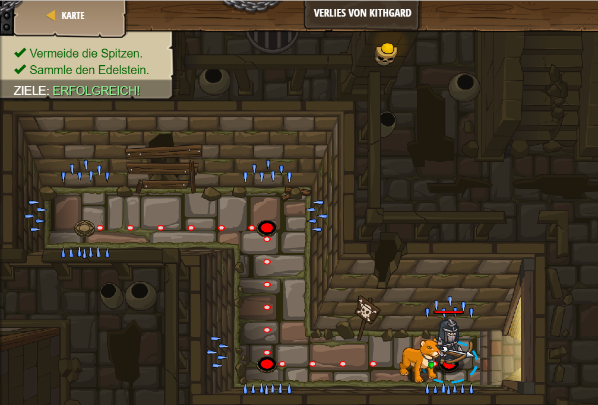

# Level 1
___
* Erklärung: In Level 1 geht es darum, dass man einen sog. "hero" durch ein Labyrinth laufen lässt, dabei einen Edelstein einsammelt und dabei darauf achtet, dass er an keine Stachelwand stößt
    * In diesem Level habe ich sog. Methoden verwendet, um meinen hero durch das Labyrinth zu navigieren. Wichtigt dabei ist, dass man nach jeder Methode eine Klammer () setzt und ein symikolon ;. Mein code sieht folgendermaßen aus: 


```js
hero.moveRight();
hero.moveDown();
hero.moveRight();
```


