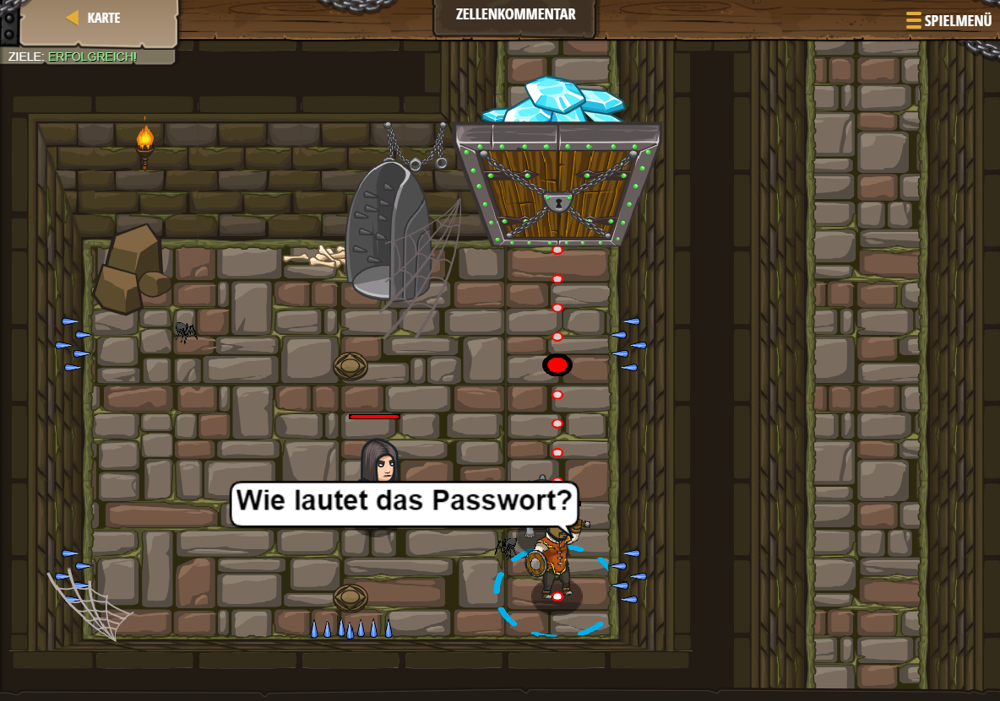

# Level 10
___

``` js
// Befreie Patrick, welcher hinter der "schwachen Tür" ist.
hero.moveRight();
hero.attack("Weak Door");
// Töte die Wache mit dem Namen "Two"
hero.moveRight(3);
hero.moveDown();
hero.attack("Two");
hero.attack("Two");
// Erhalte den Edelstein.
hero.moveDown();
hero.moveDown();
```

 