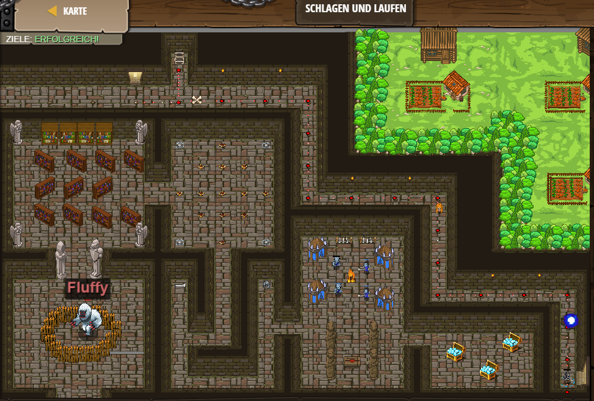

# Level 13
___

```js
// Du kannst vor einer Schleife Code schreiben.
hero.moveRight();
hero.moveUp();
// Zerstöre die Kiste bevor du mit Hilfe einer Schleife dem Labyrinth entkommst.
var enemy = hero.findNearestEnemy();
hero.attack("Chest");
// Return back back into the main hallway.
hero.moveDown();
while(true) {
    // 3 Mal bewegen.
    hero.moveRight(3);
    hero.moveDown(3);   
}
```

