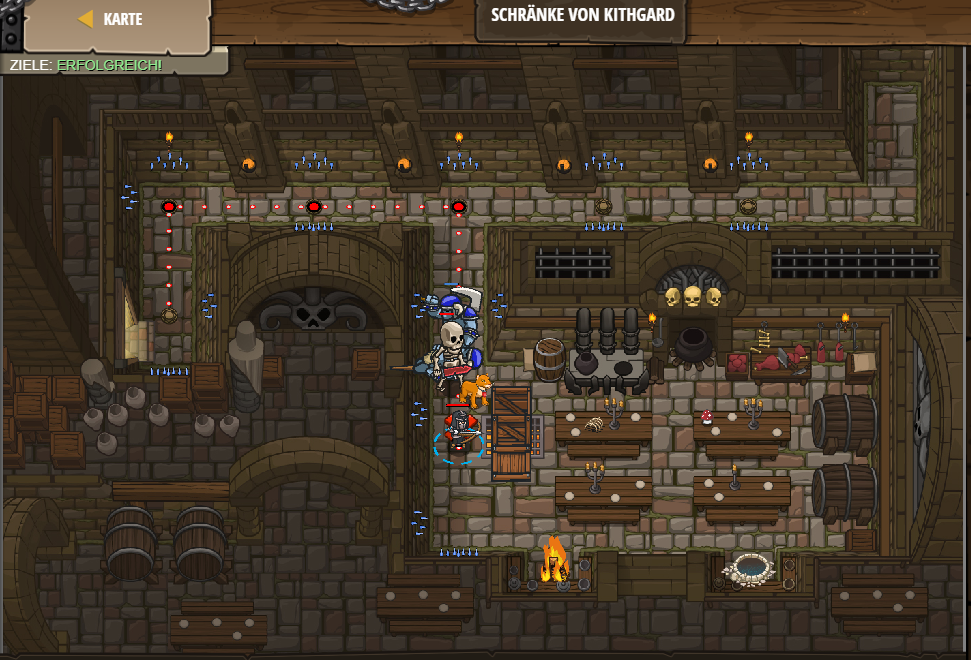

# Level 14
___

```js
// Da ist ringsherum vielleicht etwas, dass dir hilft!

// Als erstes gehe zum Schrank.
    hero.moveUp();
    hero.moveRight(2);
    hero.moveDown(2);
// Dann greife den Schrank ("Cupboard") in einer while Schleife an.
while(true) {
    hero.attack("Cupboard");
}
```

