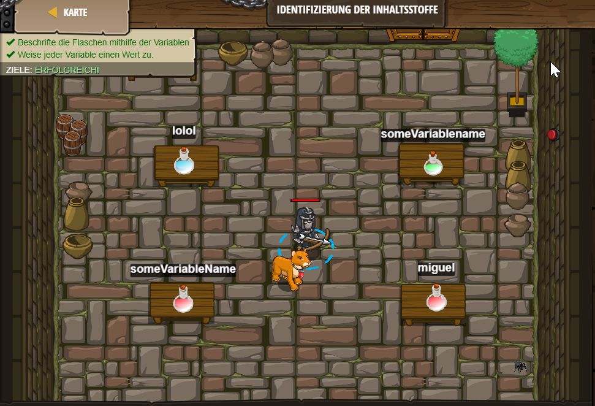

# Level 17
___

```js
// Eine Variable ist ein Behälter mit Beschriftung, der Daten erhält.

// Diese Variable heisst `someVariableName`
// Sie enthält den Wert `"ein Text"`
var someVariableName = "a string";

// Diese Variable heisst `lolol`
// Sie enthält die Zahl `42`
var lolol = 42;

// Erzeuge 2 weitere Variablen und weise ihnen Werte zu:
// Du kannst sie benennen, wie du willst, und beliebige Werte in ihnen speichern!
// Brauche  `=` um einer Variable einen Wert zuzuweisen.
var someVariablename = "a string";
var miguel = 69;

var someVariablename = "a string"
var nima = "187"
```

