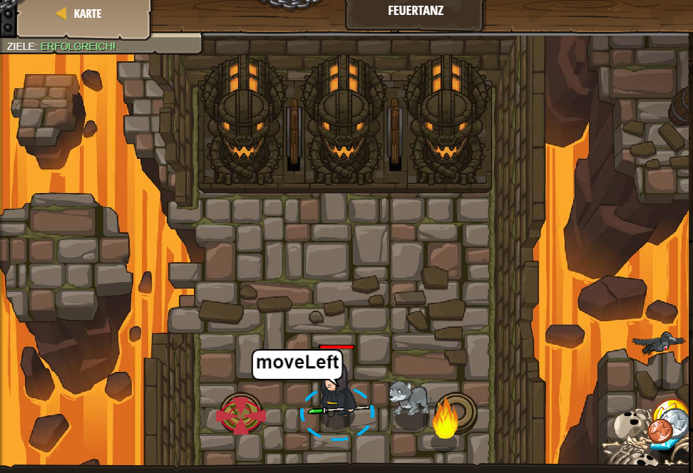

# Level 19
___

```js
// Code wird normalerweise  in der Reihenfolge ausgeführt, in der er geschrieben wurde.
// Schleifen wiederholen einen Codeblock mehrmals.

while(true) {
    hero.moveRight();
    // Füge hier eine moveLeft Anweisung in die Schleife ein.
    hero.moveLeft();  
}
```

