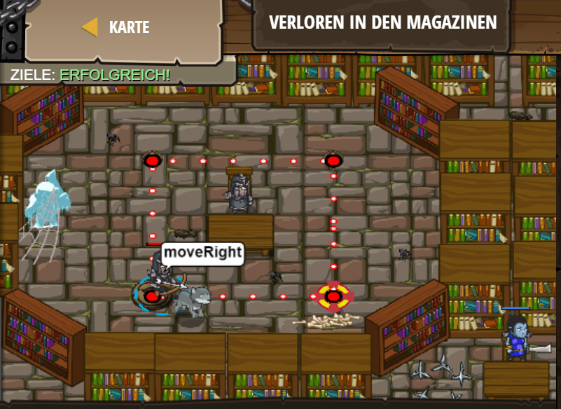

# Level 26
___
```js
// Schleifen wiederholen einen Code-Block mehrere Male.
// Ein Code-Block beginnt mit {
// Ein Code-Block endet mit }

while(true)
// Ergänze { hier,  um einen Code-Block zu beginnen.
 {
    hero.moveRight();
    hero.moveUp();
    hero.moveLeft();
    hero.moveDown();
// Ergänze } hier,  um einen Code-Block zu beginnen.
}
```  
