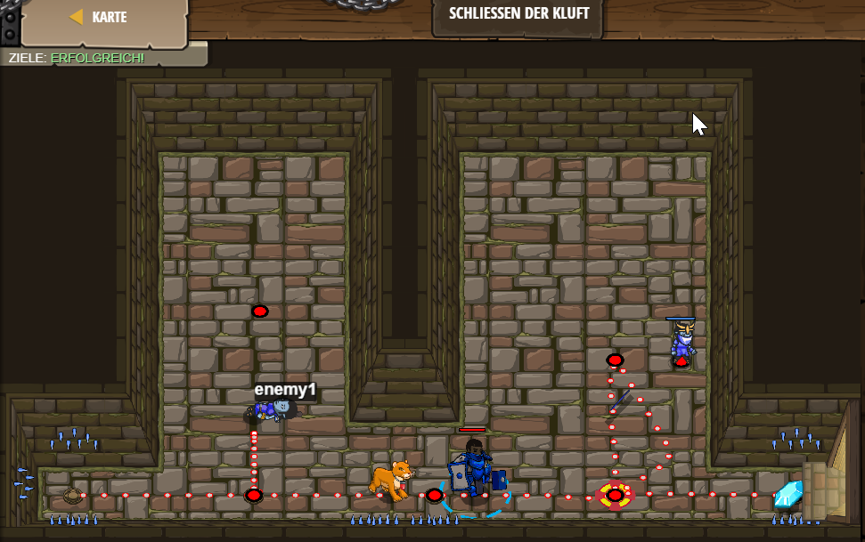

# Level 28
___

```js
hero.moveRight();

// Das sollte dir aus dem letzten Level bekannt vorkommen.
var enemy1 = hero.findNearestEnemy();

// Nun attackiere enemy1.
hero.attack(enemy1);
hero.attack(enemy1);
hero.moveRight(2);
hero.moveUp();
var enemy2 = hero.findNearestEnemy();
hero.attack(enemy2);
hero.moveRight();
```

