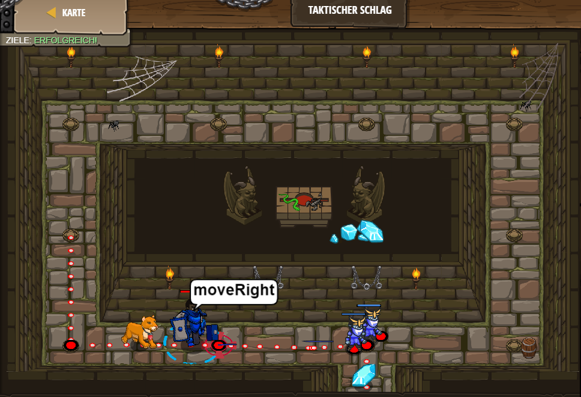

# Level 29
___

```js
// Besiege die Oger
hero.moveDown();
hero.moveRight();

  var enemy = hero.findNearestEnemy();
hero.attack(enemy);
    var enemy = hero.findNearestEnemy();
hero.attack(enemy);
hero.moveDown();
```
