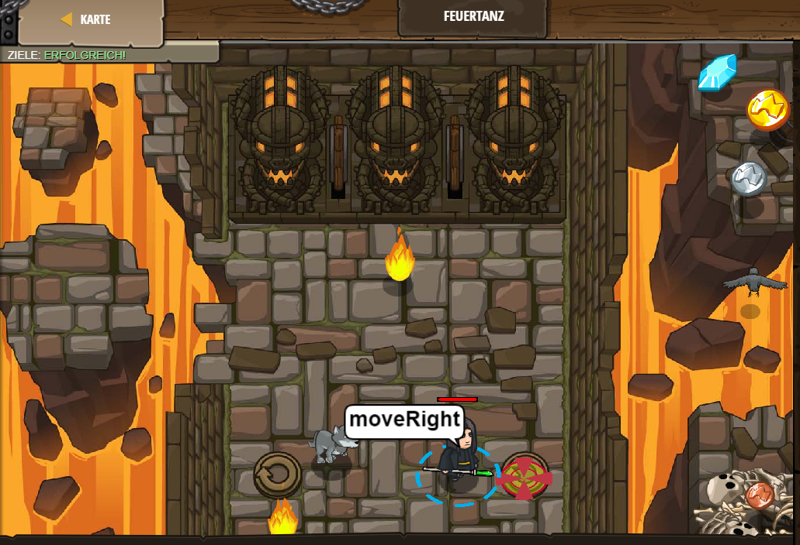

# Level 3
___
* Erklärung: In Level 3 geht es darum in einem Raum von ganz links nach ganz rechts zu laufen, um Feuerbällen auszuweichen.
    * Dabei ist es sinnvoll eine Schleife zu verwenden, um keinen unendlich langen code zu haben da sich eine Schleife solange eine bestimmte bedingung erfülllt wird immer wiederholt. Ich habe in dem Fall eine Kopfgesteuerte Schleife verwendet und mein Code sieht wie folgt aus:
 
```js
while(true) {
    hero.moveRight();
    // Füge hier eine moveLeft Anweisung in die Schleife ein.
    hero.moveLeft();  
}
```

