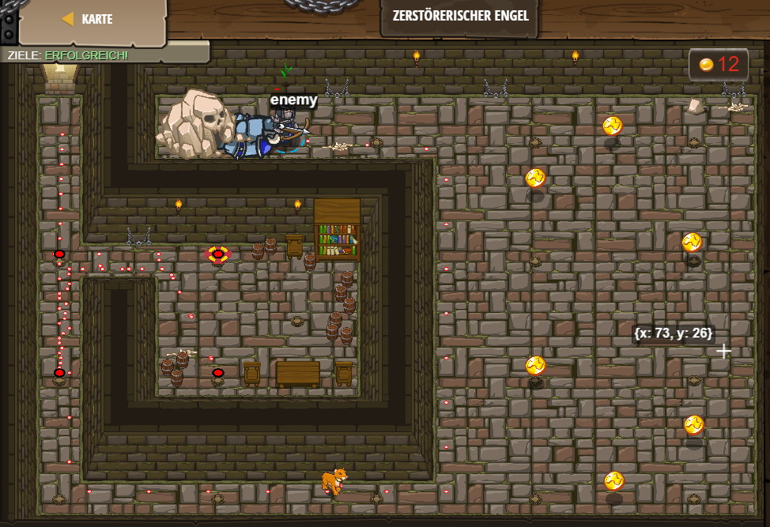

# Level 33
___

```js
hero.moveDown();

// Mama sagt immer, es ist gut, verschiedene Pilze zu essen, die in Kerkern wachsen.
hero.moveDown();
hero.moveRight();
hero.moveLeft();
hero.moveUp();
hero.moveLeft();
hero.moveRight();
hero.moveUp();
// Finde den Weg zum Wächter des Kerkers.
while(true) {
    var enemy = hero.findNearestEnemy();
    if (enemy) {
        hero.attack(enemy);
    }
}
```
