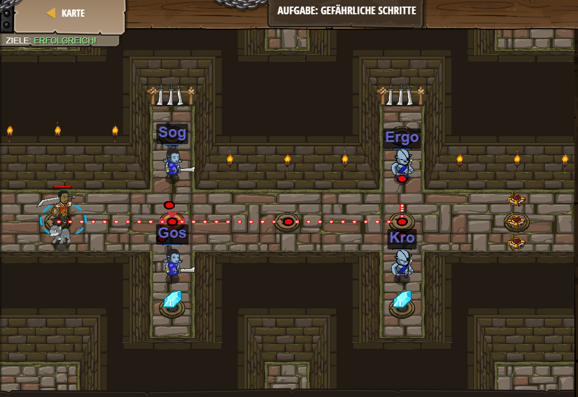

# Level 34
___

```js
// Besiege die Oger, indem du deren Namen ausnutzt.
hero.moveRight();
// Besiege das erste Paar von Ogern.
var enemy = hero.findNearestEnemy();
hero.attack("Sog");
hero.attack("Sog");
hero.attack("Gos");
hero.attack("Gos");
hero.moveRight(2);
// Besiege das zweite Paar von Ogern.
var enemy = hero.findNearestEnemy();
hero.attack("Ergo");
hero.attack("Ergo");
hero.attack("Kro");
hero.attack("Kro");
```

