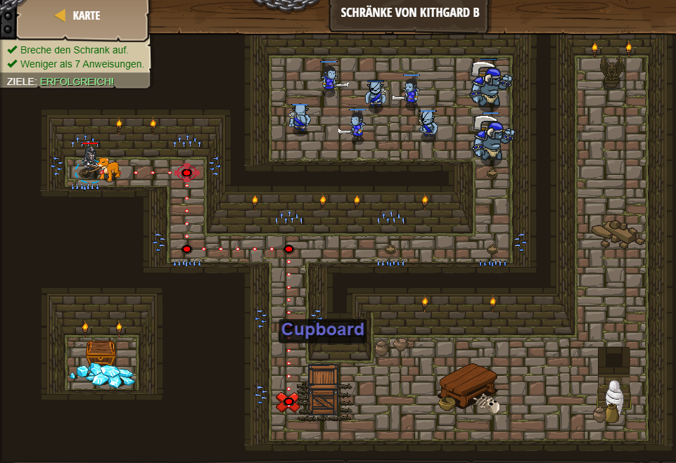

# Level 35 
___

```js
// Da ist ringsherum vielleicht etwas, das dir hilft!

// Als erstes gehe zum Schrank.
hero.moveRight();
hero.moveDown();
hero.moveRight();
hero.moveDown(2);
// Dann greife den Schrank "cupboard" mit einer while Schleife an.
hero.attack("Cupboard");
```

