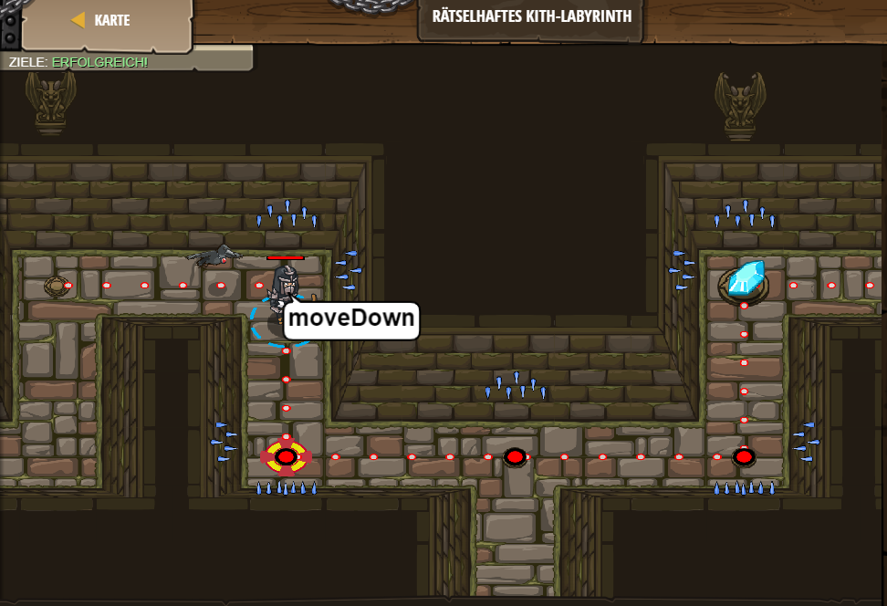

# Level 38
___

```js
// Schleifen sind besser um Wiederholungen zu bearbeiten.

while(true) {
    // Füge hier Befehle ein, die wiederholt ausgeführt werden sollen.
    hero.moveRight();
    hero.moveDown();
    hero.moveRight(2);
    hero.moveUp(); 
}
```

