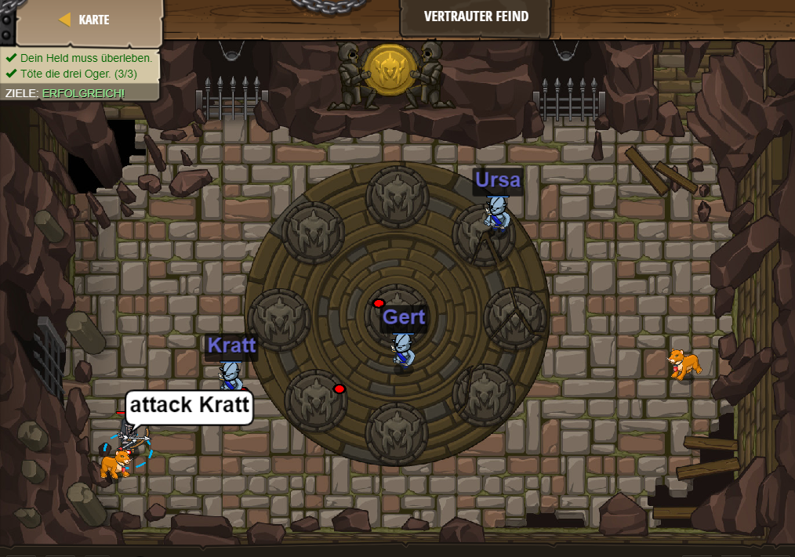

# Level 4
___
* Erklärung: In Level 4 geht es darum, dass der Hero in einem Raum von drei gegnern angegriffen wird und diese drei gegner besiegen
muss.
    * Dabei sollen variablen verwendet werden. Die Variable dient dazu einer bestimmten sache ewas zuzuordnen, damit man eine Aktion auf etwas mit einer festgelgeten Variable ausführen kann. Mein Code sieht wie folgt aus:
 
```js
var enemy1 = "Kratt";
var enemy2 = "Gert";
var enemy3 = "Ursa";

hero.attack(enemy1);
hero.attack(enemy2);
hero.attack(enemy3);  
```


