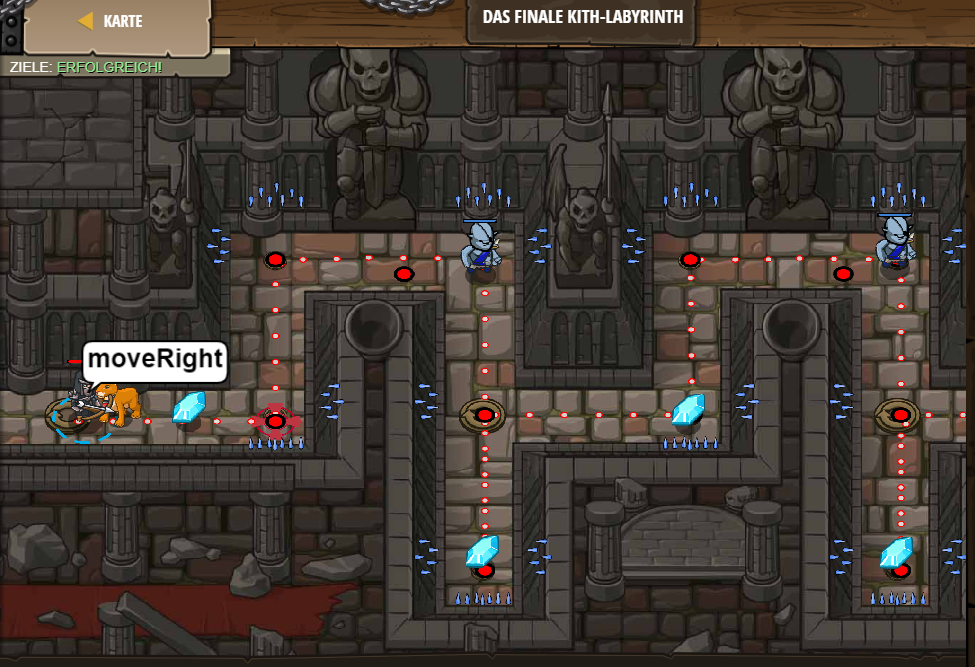

# Level 40
___

```js
// Nutze eine Schleife (`loop`), um dich sowohl zu bewegen als auch anzugreifen.

while(true) {
    hero.moveRight();
    hero.moveUp();
    hero.moveRight();
      var enemy = hero.findNearestEnemy();
    hero.attack(enemy);
    hero.moveDown(2);
    hero.moveUp();    
}
```
