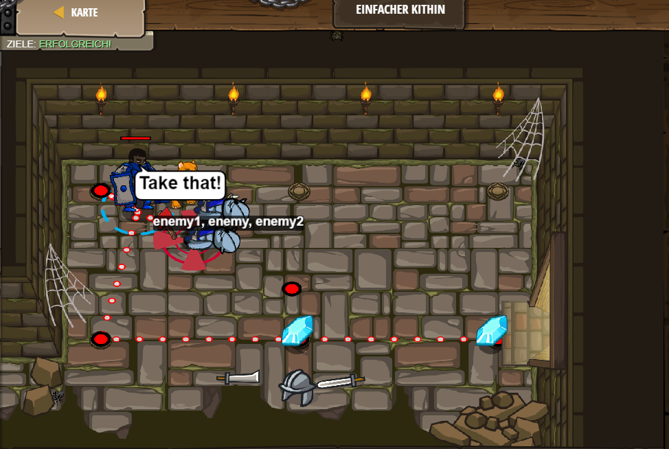

# Level 41
___

```js
// Erzeuge eine zweite Variable, und greif sie an.

var enemy1 = hero.findNearestEnemy();
var enemy = hero.findNearestEnemy();
var enemy2 = hero.findNearestEnemy()
hero.attack(enemy1);
hero.attack(enemy);
hero.throwAt(enemy);
 hero.moveDown();
 hero.moveRight(2);
 ```

 