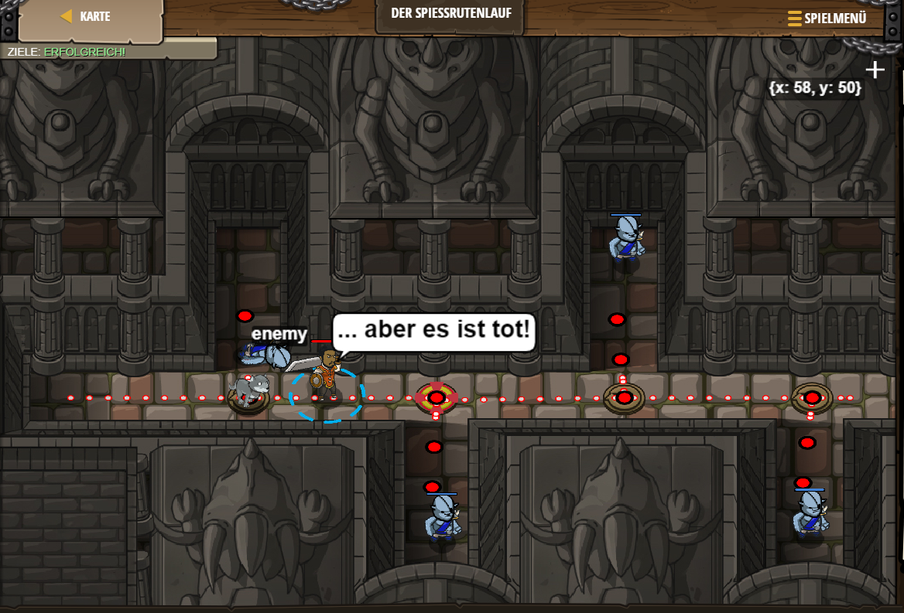

# Level 42
___

```js
// Verwende, was du gelernt hast, um die Oger zu besiegen.
// Denk daran, dass zwei Angriffe benötigt werden, um die Oger zu besiegen!
while(true) {
    hero.moveRight();
    var enemy = hero.findNearestEnemy();
    hero.attack(enemy);
    hero.attack(enemy);
}
```
