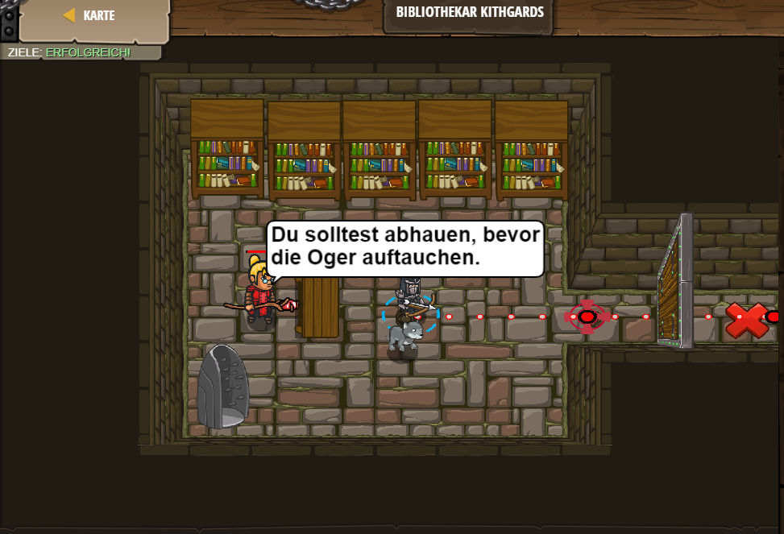

# Level 44
___
```js
// Du benötigst ein Passwort, um die Tür zur Bibliothek zu öffnen!
// Das Passwort findest du in der Hilfe!
// Klick auf den blauen Tipps-Knopf über dem Codefenster.
// Wenn du nicht weiterkommst, dann klicke auf Tipps!

hero.moveRight();
hero.say("Hush");  // ∆
hero.moveRight();
```
