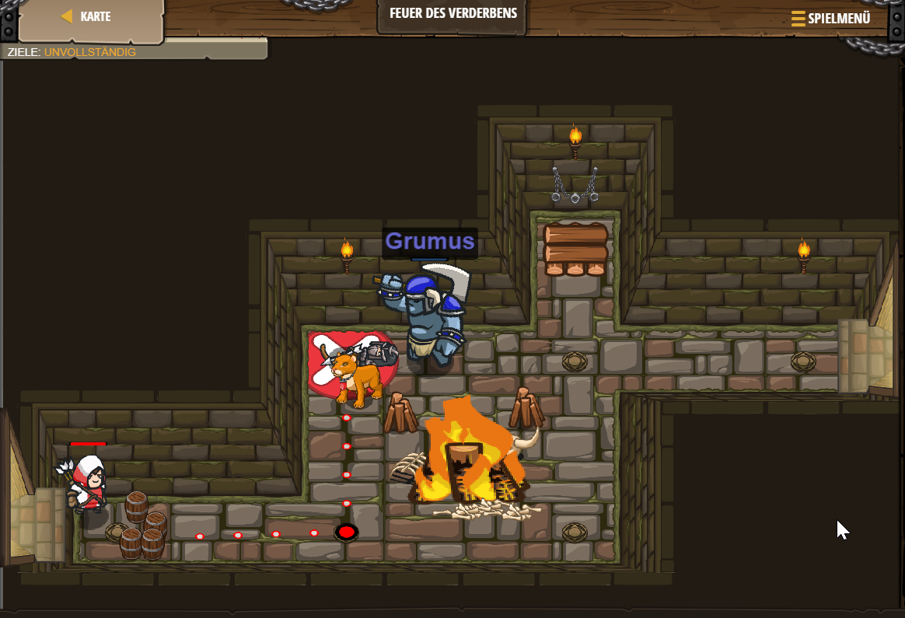

# Level 48
___
```js
// Der Oger sieht groß und langsam aus. Bewegung hilft dir, seinen tödlichen Attacken zu entkommen.
hero.moveRight();
hero.moveUp();
hero.attack("Grumus");
hero.attack("Grumus");
hero.moveDown();
hero.attack("Grumus");
hero.attack("Grumus");
hero.moveRight(2);
hero.moveUp();
hero.moveRight(2);
hero.moveUp();
hero.moveRight(2);
```
